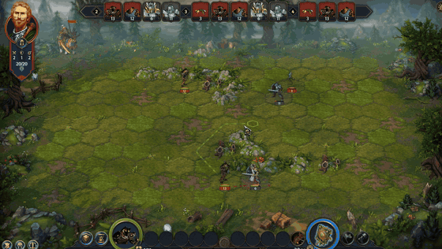
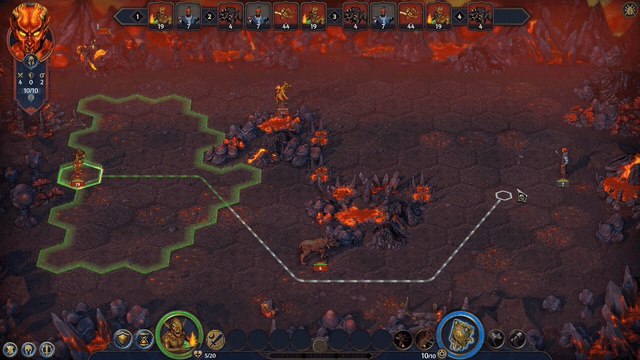
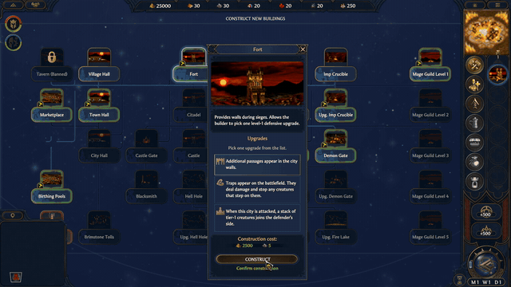
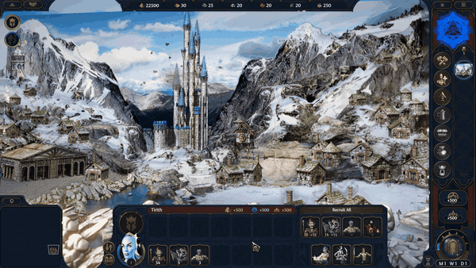
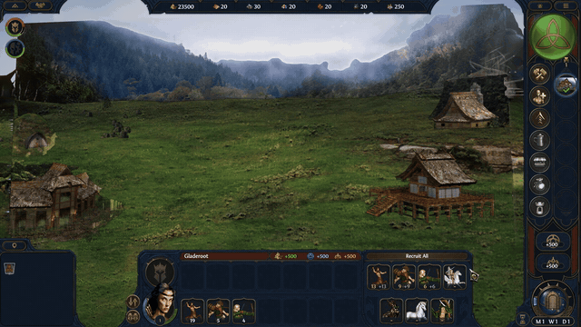
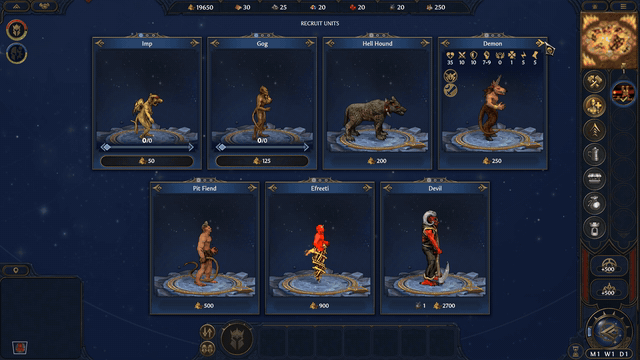
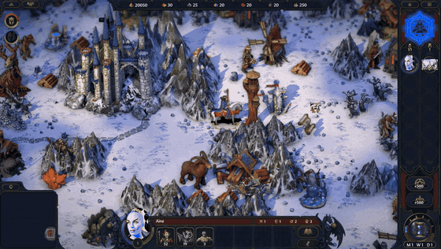
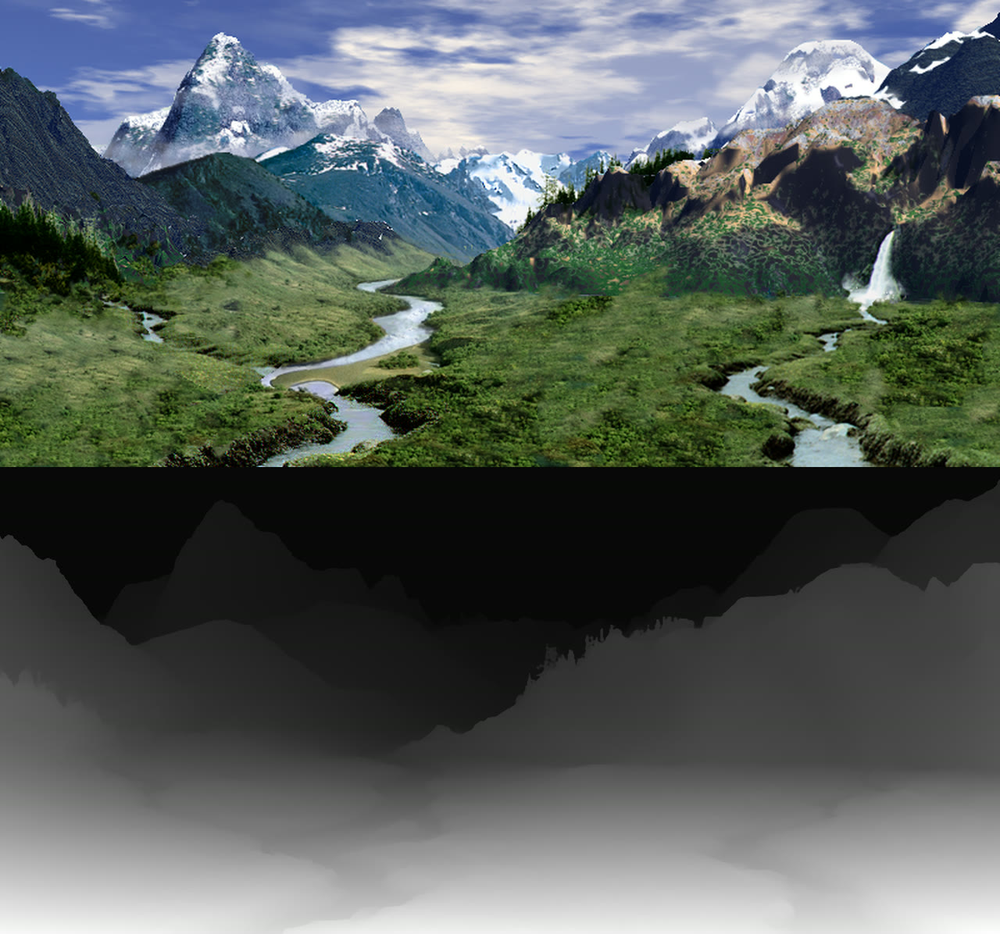
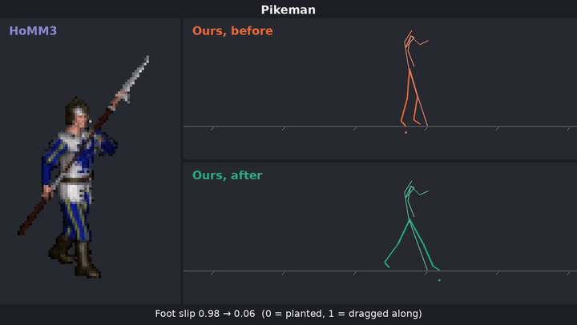
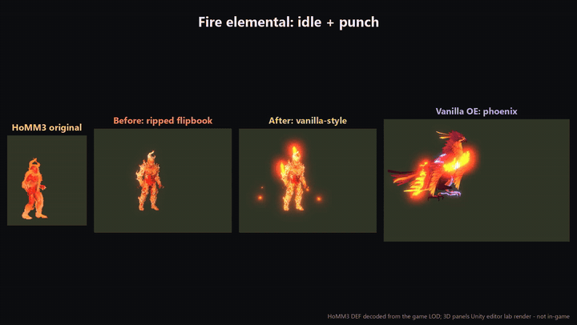

> **Preview build.** v0.1.321 is a preview, not a finished release. It still has a lot of issues: Castle animations got a full pass and Rampart's has started, but many other units still have very unfinished animations. Expect rough edges, and please report what you find.
>
> **Already installed an earlier version?** Run the v0.1.321 installer and choose **Update an existing Golden Era copy**. (The v0.1.319 download was broken and installed an older August build; updating fixes that too.)

> This release is built for Olden Era Steam build 25672315 (depot 3105441, manifest 7750145598966689713), the current Steam build as of October 2026. If your Steam install is on that build, just point the installer at it. If Steam has updated past it, the installer will walk you through downloading an extra copy of that build from Steam to make this as painless as possible.
> The installer does not patch your Steam install in place. It copies your clean Steam game folder to a separate Golden Era folder and installs the mod into that copy only.

# Golden Era: A mod for Heroes of Might and Magic: Olden Era

The goal of this mod is to integrate HD-2D factions modeled after Heroes of Might and Magic 3 factions. The installer uses your Steam Olden Era folder as a clean source, creates a separate modded copy, and asks for a Heroes of Might and Magic 3 install directory, either HoMM3 Complete from GOG (recommended) or HoMM3: HD from Steam.

This is an experimental early-access mod. Stronghold is still the most complete reference faction, and newer faction ports are included at different maturity levels while balance, mechanics, UI, and asset coverage continue to evolve.

## Features

- Adds multiple HoMM3-inspired custom faction ports to Olden Era.
- Adds custom creature lineups, alternate creature upgrades, town screens, buildings, heroes, portraits, map sprites, unit animations, and music where available.
- Full 3D town scenes for all 12 custom factions, built from the HoMM3 town art.
- 3D animated creature models for the custom factions and HoMM3 neutrals, animated from the original HoMM3 animations.
- 3D adventure-map meshes for faction towns and many HoMM3 map buildings, plus 3D artifact models.
- Vanilla-style visual effects for unit abilities and idle auras.
- Adds faction mechanics such as War Cries and other custom-faction rules as they are ported.
- Ships a small installer EXE that downloads the BepInEx IL2CPP loader, Golden Era plugin payload, release-derived Core.zip overlay, campaign StreamingAssets, dialog-portrait Unity resources, and Factory city metadata pin from the matching GitHub Release's assets.
- Installs into a separate Golden Era game copy so launching Olden Era from Steam still runs the vanilla game.
- Updates existing Golden Era copies in place when the target folder still has its installer-created clean `Core.zip` baseline.

## Current Faction Status

The current public package includes the expanded custom-faction framework and assets for Castle, Rampart, Tower, Inferno, Necropolis, Dungeon, Stronghold, Fortress, Conflux, Cove, Factory, and Bulwark. Stronghold remains the most complete reference implementation. I need your balance suggestions, since I spent the last month making this mod instead of playing Olden Era, so I don't know how to balance it.

## Major Known Bugs

- Many units still have very unfinished animations.
- Quick play faction icons: a fix is included since v0.1.320 but not yet confirmed in game.
- The recruit panel can glitch in custom-faction towns. I'm investigating it.
- Some flying creatures still have rough flight animations.

## Installation

1. Make sure both Olden Era and Heroes of Might and Magic 3 are installed on your computer.
2. Open the latest GitHub Release and download one portrait variant EXE:
   - `GoldenEraModInstaller-*-upscaled-portraits.exe`, or
   - `GoldenEraModInstaller-*-standard-portraits.exe`
3. Double-click the EXE. On first run it downloads the mod payload from that same Release (about 12 GB, split into several part files) and checks the SHA-256 hash before installing.
4. The wizard will ask for a clean Olden Era build 25672315 folder (your Steam install if it's on that build, otherwise the depot download), a separate modded copy folder, and your HoMM3 installation.
   The modded copy needs about 22 GB of free space on its drive (the game files plus the unpacked mod), and the download needs another 12 GB wherever the installer is saved.

An internet connection is required for the first payload download. For an offline install, also download every payload part file from the Release (every `golden_era_release_payload-v0.1.321.zip.partNN` file) into the same folder as the EXE before running it.

## Modding Guide

The `modding_guide/` folder contains [mod_helper.md](modding_guide/mod_helper.md), a practical Olden Era modding reference, and a snapshot of [GameSymbols.cs](modding_guide/GameSymbols.cs), the central symbol registry used by the Golden Era plugin. These files are intended as reference material for modders working against the Steam IL2CPP build, not as a supported public API.

## Screenshots

### How it was made

## FAQ

### Will new updates to Olden Era break this mod?
No, the mod installs into a separate game folder that does not get automatic steam updates.

### Can I still play vanilla Olden Era through Steam?
Yes. Steam should keep launching your untouched vanilla install. Use `Launch Golden Era.cmd` from the separate target folder when you want to play the mod.

### How do I submit bug reports, balance feedback, and suggestions?
Use the Issues tab in github and choose the relevant form: Bug report, Balance issue, or Suggestion. You can also report bugs from the in-game bug report button. A report includes your description, the mod's log files with file paths and usernames scrubbed, a list of installed mod files, and a screenshot only if you tick the box. Reports go to a private folder only I can see and are deleted after 90 days. GitHub Issues and in-game reports are the only places feedback will be monitored.

### Why not make a discord server or subreddit for feedback?
Because I don't want to moderate one.

### Does this support multiplayer?
Multiplayer is entirely untested at this time.

### Does this include the damage histogram mod?
No. The damage histogram is now a separate mod/project and is not included in the Golden Era installer.

### How do I donate to contribute to this project?
I do not need money to make this mod. However, if you would like to contribute to my marriage, you may donate to my kofi to make my wife less upset about my cloud compute spending: https://ko-fi.com/levi9753

### My antivirus says this is malware
It's not, you can inspect the source to prove it. The installer is an unsigned EXE that downloads the mod payload from this repo's Releases, so you may have to click a "Run Anyway" button or something similar.

## About Me
I am a Senior Data Scientist with a long-time passion for video games. I have been working with and training language models since well before ChatGPT became popular, and for the sake of my career and knowledge, I was overdue on learning the ins and outs of various coding tools that have recently become available. This project began as an experiment to see what Cursor was capable of, and the scope of the project expanded as I explored other tools (Claude Code, Codex, Cline with Deepseek v4 Pro). Eventually, I decided to polish this up and open it to feedback, so I could learn a bit more about handling github issues and messy technical projects like this one.

## Credits

Special thanks to Aphra for creating the Tears of Ashan VCMI mod and for granting permission to use that mod's sprite recolors. Thanks to bayleDomon for enhancements to the campaign map generation. Thanks to the dedicated HoMM3 modding community for decades of documentation on how to pull apart that game and put it back together.
